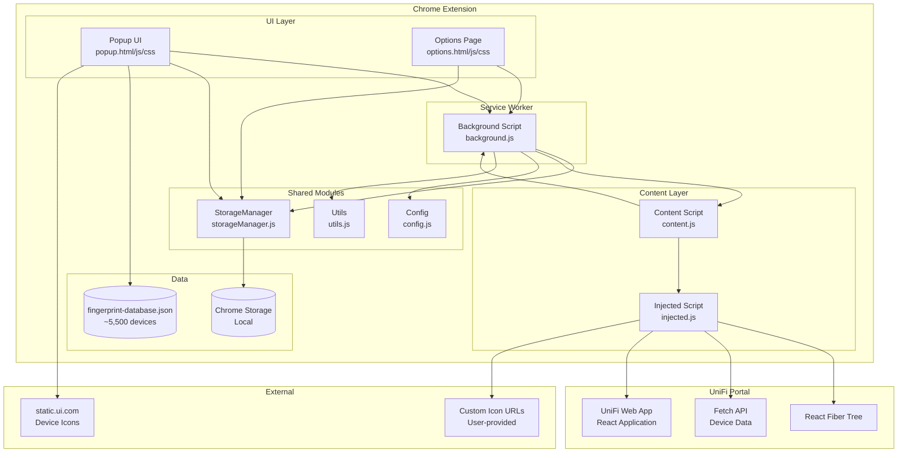
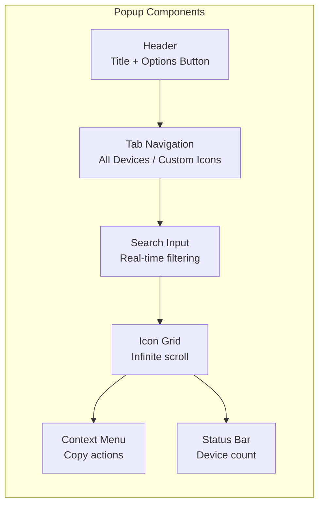
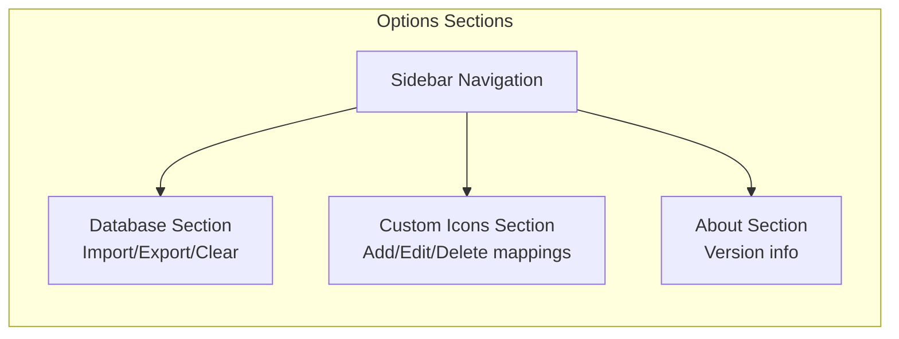
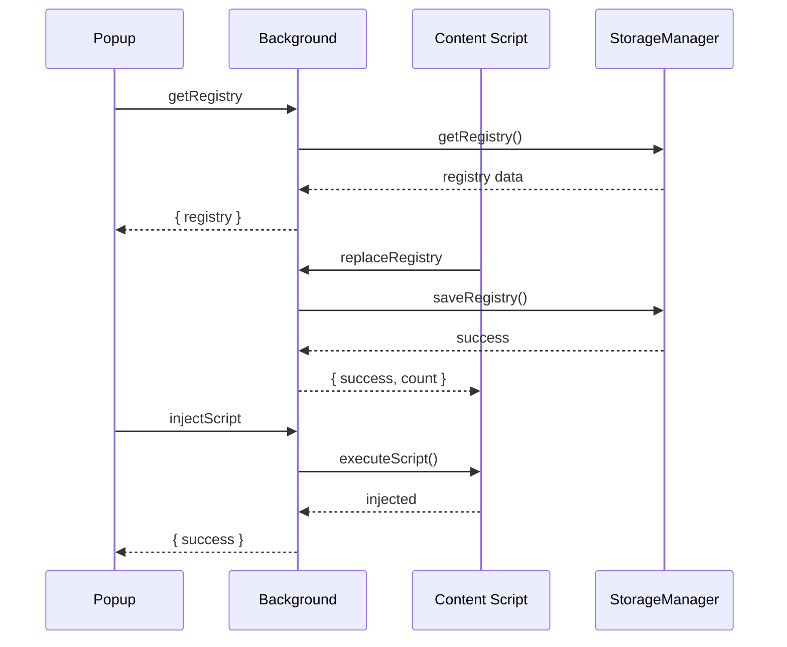
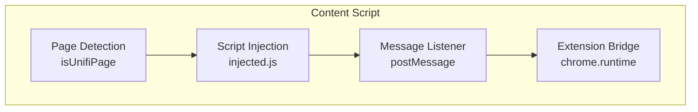
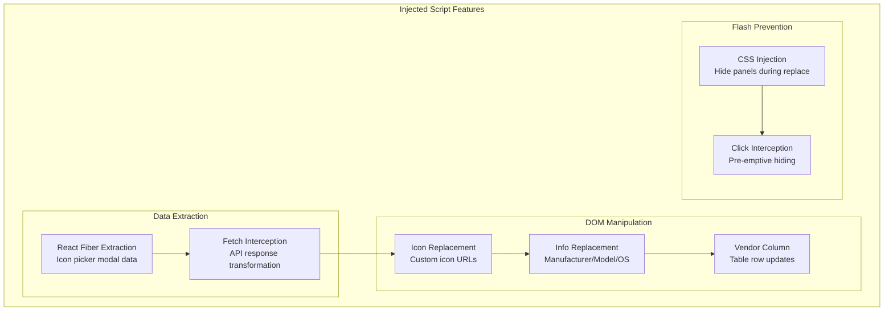
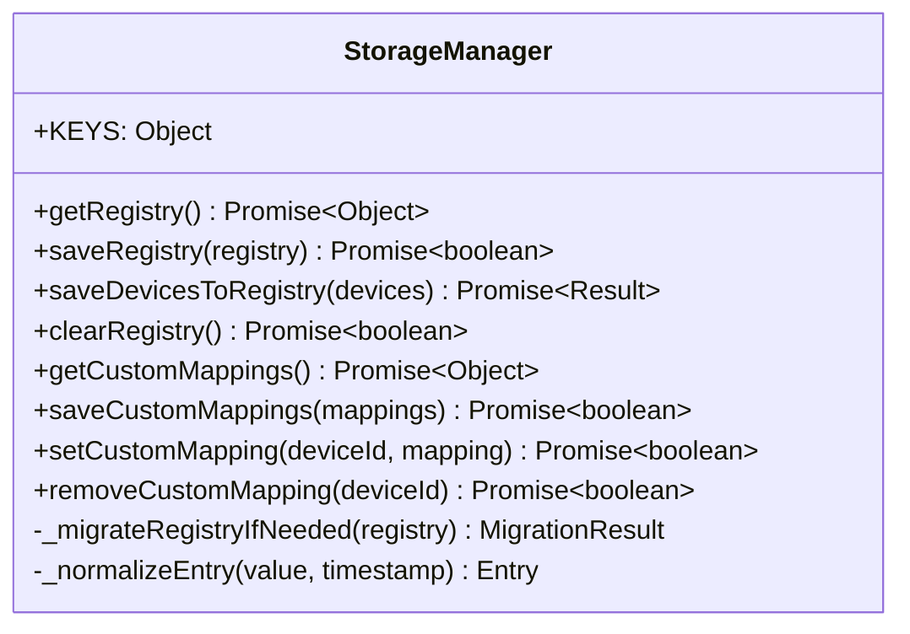
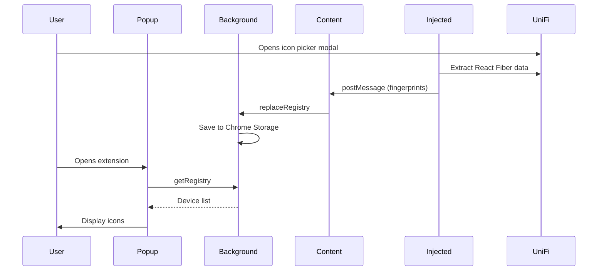
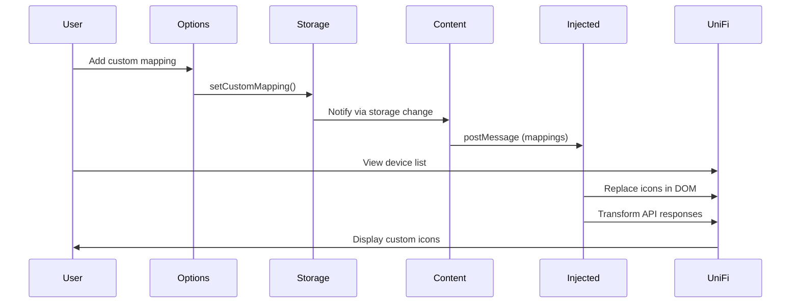

# UniFi Icon Browser - Architecture Documentation

This document describes the technical architecture of the UniFi Icon Browser Chrome Extension.

## System Overview

The UniFi Icon Browser is a Chrome Extension (Manifest V3) that enables browsing, searching, and customizing UniFi device icons. It consists of multiple interconnected components that work together to provide a seamless user experience.

## Architecture Diagram



## Component Architecture

### 1. UI Layer

#### Popup (`popup/`)
The extension popup provides the primary user interface for browsing device icons.



**Key Features:**
- Tab-based navigation (All Devices / Custom Icons)
- Real-time search filtering
- Infinite scroll with pagination (50 items per page)
- Context menu for quick actions
- Direct link to options page

#### Options Page (`options/`)
Full-page settings interface for managing custom icon mappings.



### 2. Background Service Worker

The background script (`background.js`) serves as the central coordinator for the extension.



**Message Actions:**
| Action | Description | Direction |
|--------|-------------|-----------|
| `getRegistry` | Retrieve device registry | Popup → Background |
| `saveToRegistry` | Save devices (merge) | Content → Background |
| `replaceRegistry` | Replace entire registry | Content → Background |
| `clearRegistry` | Clear all device data | Popup → Background |
| `exportRegistry` | Export for backup | Options → Background |
| `importRegistry` | Import from backup | Options → Background |
| `injectScript` | Manual script injection | Popup → Background |

### 3. Content Layer

#### Content Script (`content.js`)
Runs in the context of UniFi web pages, acting as a bridge between the extension and the page.



**Responsibilities:**
- Detect UniFi pages using URL patterns and DOM elements
- Inject the page script (`injected.js`)
- Bridge communication between injected script and background
- Load and forward custom icon mappings

#### Injected Script (`injected.js`)
Runs in the page context with full access to the page's JavaScript environment.



### 4. Shared Modules

#### Config (`config.js`)
Centralized configuration constants.

```javascript
Config = {
    URLS: { ... },           // Base URLs for icon loading
    PAGINATION: { ... },     // Items per page, scan limits
    TIMEOUTS: { ... },       // Various timeout values
    INTERVALS: { ... },      // Polling intervals
    VALIDATION: { ... },     // Input validation rules
    COLORS: { ... },         // UI colors
    STORAGE_KEYS: { ... },   // Chrome storage keys
    PATTERNS: { ... },       // Regex patterns
    SELECTORS: { ... }       // DOM selectors
}
```

#### Utils (`utils.js`)
Shared utility functions.

| Function | Purpose |
|----------|---------|
| `escapeHtml()` | XSS prevention |
| `formatRelativeTime()` | Time display |
| `debounce()` / `throttle()` | Performance optimization |
| `isUnifiUrl()` | URL detection |
| `extractDeviceIdFromUrl()` | Parse fingerprint IDs |
| `buildFingerprintUrl()` | Construct icon URLs |
| `looksLikeUserDeviceName()` | Filter user device names |

#### StorageManager (`storageManager.js`)
Centralized Chrome storage operations.



## Data Flow

### Device Database Flow



### Custom Icon Flow



## Storage Schema

### Device Registry
```json
{
  "unifiDeviceRegistry": {
    "12345": {
      "name": "Apple iPhone 14 Pro",
      "addedAt": 1704067200000
    },
    "67890": {
      "name": "Samsung Galaxy S23",
      "addedAt": 1704067200000
    }
  }
}
```

### Custom Icon Mappings
```json
{
  "customIconMappings": {
    "500": {
      "name": "My Custom Device",
      "iconUrl": "https://example.com/icon.png",
      "deviceName": "Custom Server",
      "manufacturer": "Custom Corp",
      "model": "Model X",
      "os": "Linux",
      "addedAt": 1704067200000
    }
  }
}
```

## Security Considerations

### XSS Prevention
- All user-provided content is escaped using `Utils.escapeHtml()`
- Custom icon URLs are validated before use
- DOM manipulation uses safe methods

### Permission Minimization
- Only essential permissions requested
- Host permissions scoped to UniFi-related domains
- No broad `<all_urls>` access for content scripts

### Content Security
- Injected script runs in page context (necessary for React access)
- Communication via `postMessage` with origin validation
- No sensitive data transmitted externally

## Performance Optimizations

### Debouncing & Throttling
- Search input debounced to reduce re-renders
- Scroll events throttled for pagination
- Mutation observer callbacks batched

### Lazy Loading
- Device icons loaded on-demand
- Infinite scroll pagination (50 items per page)
- Database loaded only when popup opens

### Flash Prevention
- CSS injection hides panels during replacement
- Click interception pre-emptively hides content
- `requestAnimationFrame` for smooth transitions

## Browser Compatibility

| Browser | Version | Support |
|---------|---------|---------|
| Chrome | 88+ | Full |
| Edge | 88+ | Full |
| Brave | Latest | Full |
| Opera | Latest | Full |
| Vivaldi | Latest | Full |
| Firefox | - | Not supported (Manifest V3) |
| Safari | - | Not supported |

## File Structure

```
chrome-extension/
├── manifest.json              # Extension manifest (v3)
├── data/
│   └── fingerprint-database.json  # Pre-loaded device database
├── icons/
│   ├── icon16.png
│   ├── icon32.png
│   ├── icon48.png
│   └── icon128.png
├── popup/
│   ├── popup.html
│   ├── popup.css
│   └── popup.js
├── options/
│   ├── options.html
│   ├── options.css
│   └── options.js
└── scripts/
    ├── background.js          # Service worker
    ├── content.js             # Content script
    ├── injected.js            # Page script
    ├── config.js              # Configuration
    ├── utils.js               # Utilities
    └── storageManager.js      # Storage abstraction
```
